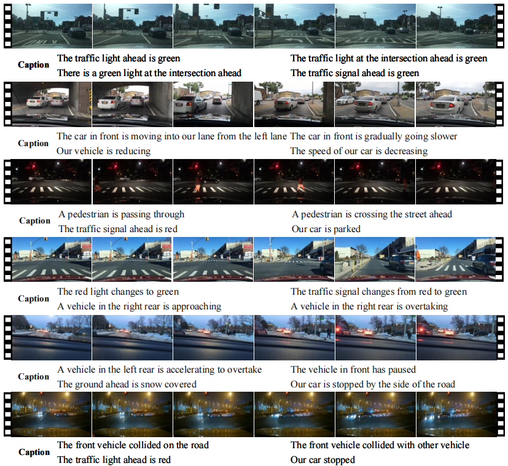
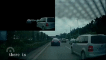
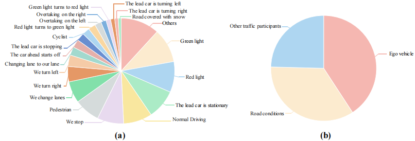

# TSEC-Dataset
Traffic Scenarios Event Caption (TSEC) Dataset for training and testing video captioning methods for driving scenes. The figure below shows some examples, the [PDF File](./dataset.pdf) provides a clearer view.  
<!--   -->

  

# What is TSEC-Dataset
General video captioning datasets are not suitable for the characteristics of driving scenes. To address this issue, we develop the Traffic Scenarios Event Caption (TSEC) Dataset to describe the key events of ego vehicle, road environment and other traffic participants. To acquire diverse types of traffic scenarios, we select the
videos that we take with our on-board camera and other public dataset videos. We also download from BiliBili and Youtube to get the traffic accident videos. Because each video
of these may contain many traffic events, we spilt the videos into distinct clips and make each sub-clip associated with 1 to 3 key events.

We follow the rules when processing the video clips: 1) In order to increase the diversity, different weathers, different periods, different road conditions and different vehicle conditions need to be selected. 2) Due to the complexity of traffic situations at intersections, a number of intersection scenarios are chosen. 3) The clip needs to contain the entire event. 4) Discard clips that are difficult to judge. Based on the above principles, we obtain 8,000 video clips with a total duration of 11.5 hours.
<!--  -->

  

# Annotation
During annotation, participants are told to imagine themselves as drivers to simulate the in-car experience. The videosshown to participants are raw videos without captions. We randomize the order of sampled videos to reduce bias. Furthermore, considering the subjectivity in evaluating key events, weinitially use a voting method to label the types of key events in the current scene. Through this approach, we identify the top four key events with the highest number of votes for eachvideo, which are then detailed. The image below: <strong>figure (a)</strong> shows the types and proportions of traffic events in the TESC dataset, and <strong>figure (b)</strong> illustrates the proportions of self-vehicle status, traffic environment, and other vehicle behaviors in TESC dataset's captions.

  

# How to get access to TSEC-dataset?
Free copies of TSEC-dataset are provided for research and private study only. A copy of the database can be requested through e-mail sent to:
haopenghui2022@gmail.com

The e-mail message must contain a description of the envisioned use of the database and a scanned version of Agreement For TVC-dataset. Please note that the End-User named must be a legal institution, or a department or section of a named legal institution, not an individual nor a project-the person signing this Agreement has to be duly authorized by the institution for such signatures (e.g., Department or Administrative Head or similar) and shall be liable for such authorization. For academic requests, please use your university e-mail. A signature of Pof. or other regular employee of academic units (Student signature may be denied). A download link will be provided after the analysis of the request. Requests may be denied.

#### Download 8000 origional videos of TSEC-Dataset

| Dataset | Download / Access Code |
|:------------:|:-----------------:|
| TSEC TRAFFIC VIDEOS  | [Baidu Cloud](https://pan.baidu.com/s/19PCw3qkR5zYZM1s63lp80w?pwd=tsec) / tses |

# Terms and Conditions of Use
# 1. Privacy
This dataset is made available for academic use only. If you find your vehicle or personal information in this dataset, please contact us and we will remove the corresponding information from our dataset. We are not responsible for any actual or potential harm as the result of using this dataset.
# 2. Copyright
The copyright of the TSEC-dataset is reserved by the Lab of computer vision and pattern recognition, Shandong University, China. The dataset described on this page is distributed under the Creative Commons Attribution-NonCommercial-ShareAlike 4.0 License, which implies that you must: (1) Attribute the work as specified by the original authors; (2) May not use this work for commercial purposes; (3) If you alter, transform, or build upon this work, you may distribute the resulting work only under the same license. The dataset is provided "as it is" and we are not responsible for any subsequence from using this dataset.